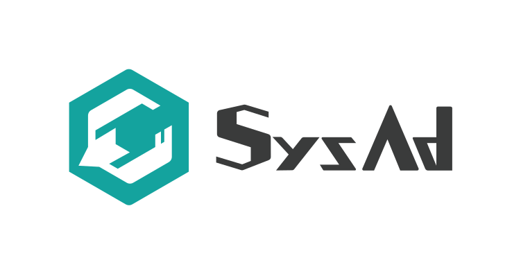
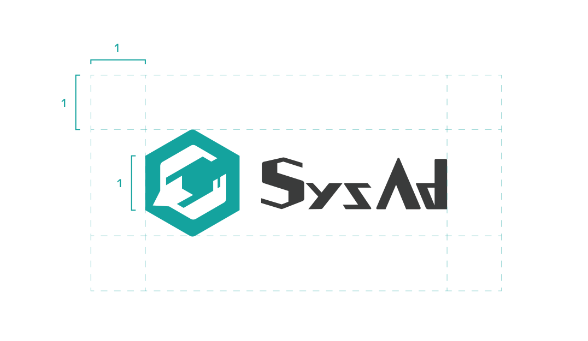

# Brand

## SysAdカラー
<link-card-container>
<color-panel title="SysAd Teal" hex="14A39E" />
<color-panel title="SysAd Gray" hex="3A3B3B" />
</link-card-container>

SysAd班のロゴなどを用いる際は、可能な限りこの色合いをベースとしたカラーリングを行ってください。

## SysAdロゴ

SysAd班を表す際のロゴです。
traP公式ロゴマークの派生デザインとなっているため、使用の際にはこのガイドラインに加え、サークルロゴデザインガイドラインを確認してください。

### カラー

色は以下の通りです。
ロゴの表示はこの2色か単色に限られます。
また、単色を用いる場合は元のロゴから受ける印象を損なわない範囲の色を使ってください。

- ロゴマーク: T400
- ロゴタイプ: NC500

### レイアウト
ロゴを使用する際は、周囲に十分な余白をとって配置してください。
六角形の1辺程度の空間を開けることが望ましいです。

#### ロゴ全体でのレイアウト例

### ロゴ全体以外での使用
可能な限りロゴマーク・ロゴアイコンを同時に用いてください。
スペースに余裕がない場合、ロゴマークのみでの使用が可能です。
ロゴタイプのみでの利用は避けてください。

### 禁止事項
- 変形、縁取り、構成要素の変更など印象を損なう加工
- 過剰に彩度が高い色など、元の印象と大幅に異なる色の使用
