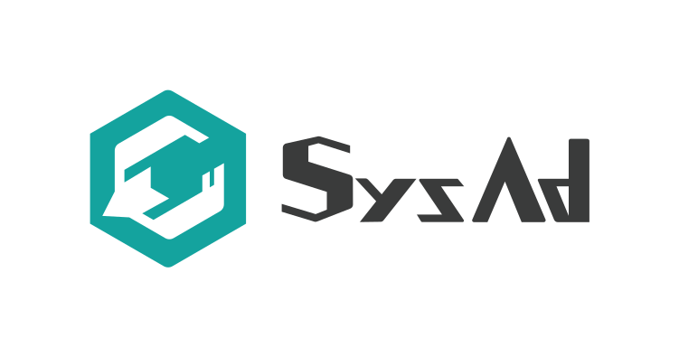
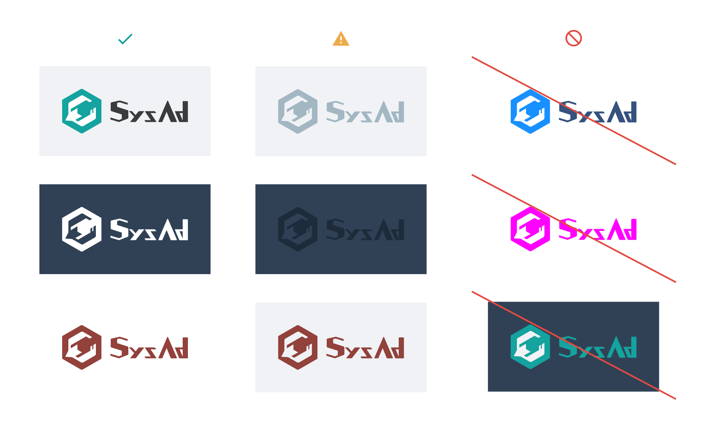
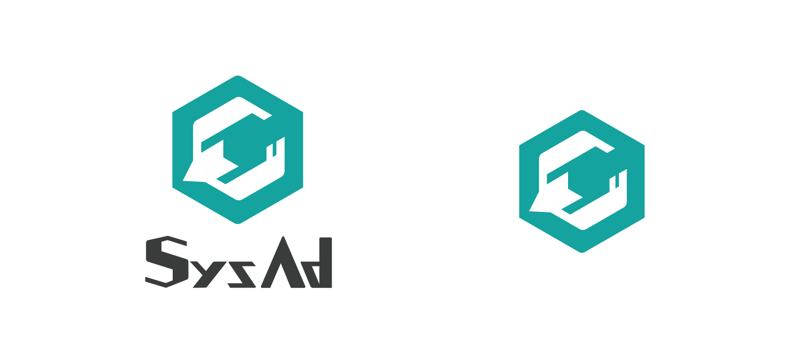
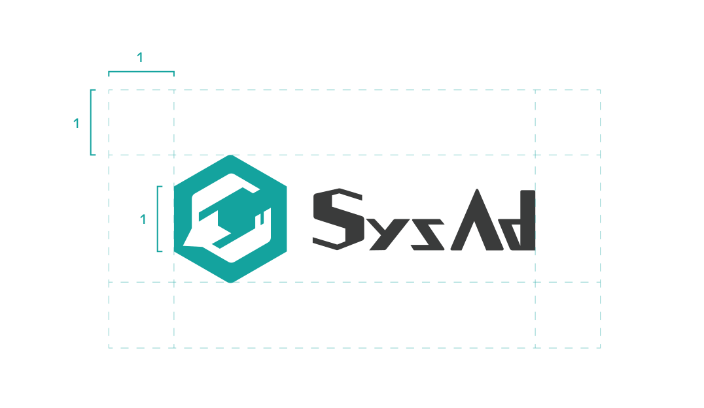
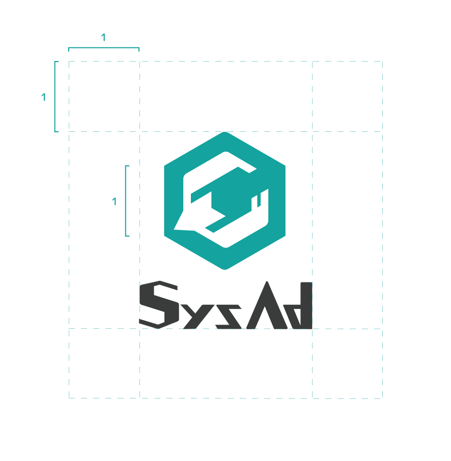
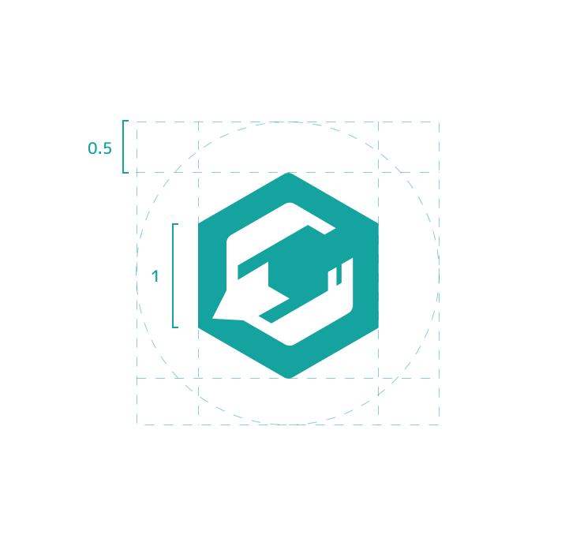

# Brand

## SysAdカラー
<link-card-container>
<color-panel title="SysAd Teal" hex="14A39E" />
<color-panel title="SysAd Gray" hex="3A3B3B" />
</link-card-container>

SysAd班のロゴなどを用いる際は、可能な限りこの色合いをベースとしたカラーリングを行ってください。

## SysAdロゴ

SysAd班を表す際のロゴです。
traP公式ロゴマークの派生デザインとなっているため、使用の際にはこのガイドラインに加え、サークルロゴデザインガイドラインを確認してください。

### カラー

ロゴに用いられている色は以下の通りです。
ロゴの表示はこの2色か、後述のルールに従う単色に限られます。

- ロゴマーク: T400 - SysAd Teal
- ロゴタイプ: NC500 - SysAd Logotype

#### 色を変更しての使用

周囲のデザインとの調和が取れないなどの理由がある場合、色を変更して用いることができます。
標準の色以外を用いる場合は、元のロゴから受ける印象を損なわず、視認性に問題のない範囲の色を用いてください。

色を変更しての使用に際しては、以下に従ってください。
- 背景に対する十分な視認性を確保する
  - ただし、デザイン上の意図・必要性がある場合を除く
- ロゴマーク・ロゴマークを同一色とする
- 過剰に彩度が高い色など、元の印象と著しく解離した色を用いない

### 別バージョンのロゴ

スペースの都合に応じて、ロゴマークとロゴタイプを縦に配置したロゴが使用可能です。

また、スペースに余裕がない場合などはロゴマークのみでの使用が可能です。
ロゴマーク単体での使用の際は原則として上記のカラーを用いるものとし、単色を使うことができます。

#### 別バージョンの使用について
可能な限りロゴマーク・ロゴアイコンを同時に用いてください。
ロゴタイプのみでの利用は禁止です。

### レイアウト
ロゴを使用する際は、周囲に十分な余白をとって配置してください。
六角形の1辺程度の空間を開けることが望ましいです。

#### スペーシング

### 禁止事項
- ロゴタイプ単体での利用
- 変形、縁取り、構成要素の変更など印象を損なう加工
  - アスペクト比を変更する加工や、文字・燕の意匠を再配置することなどがこれに該当します
- 「色を変更しての使用」の項に従わない色の利用
- 他のロゴ等の一部として、SysAdロゴ(ロゴマーク・ロゴアイコンを含む意匠全体)を形状・背景などといった形で配置すること

### その他
改変を伴う二次利用を行う際は、禁止事項及びサークルロゴデザインガイドラインに従ってください。
